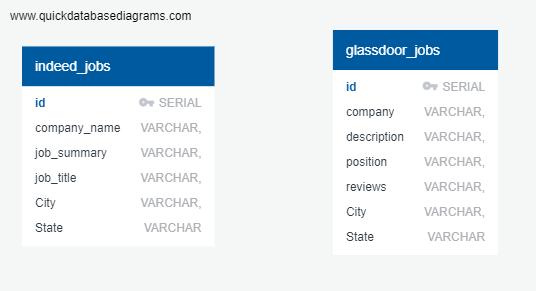

# ETL-Project

## Objective

To gather and clean code relative to the data analytics job market comparing Ohio and other populated states. 

## Finding Data

Our project used 2  sources of data:

* [Indeed.com](https://indeed.com/)

* [Glassdoor](https://www.glassdoor.com/)

## Web Scraping

We scraped data from the above web sites using Beautiful Soup and Selenium Driver. 
* While extracting the biggest challenges were:
    * a. to find out what triggered the pop ups 
    * b. to tackle those pop ups.
    * c. While doing pagination the first approach was to use the partial link text, but since similar text did appear in multiple 
        location like "company name" for example, had to change it to element.text and do a check on text.

## Data Cleanup & Analysis

Once datasets were identified, ETL on the data was performed as following:

* We used splitting and filtering to get the most relevant data, details of which are described in the report.

* PostGre SQL(relational).

* The final tables are:

    

## Project Report

The purpose of this project was to use ETL (Extract, Transform, Load) strategy to extract data from the two separate pages of Indeed.com and Glassdoor.com. The team chose these sites in order to focus of the data analytics job market. The team had one week to focus on this topic, extract, clean, and load new data. The team focused on the job markets of Ohio, Washington, New York, Massachusetts, and California in order to compare the local versus national job outlooks upon graduation of the course. For more details please reference the full project report file:  https://github.com/taylorbreychak/ETL-Project/blob/master/ETL%20Project.pdf

